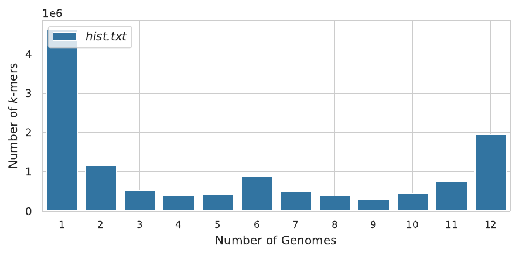
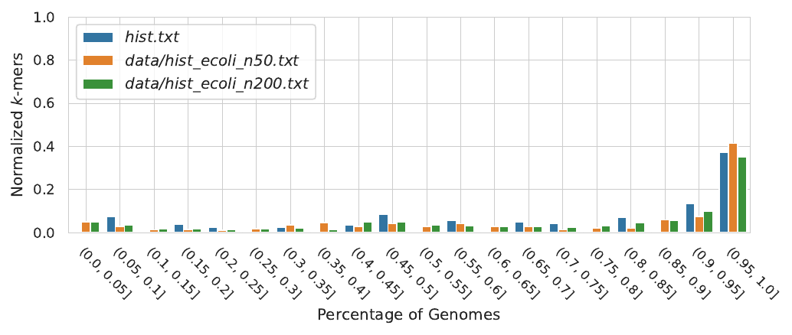
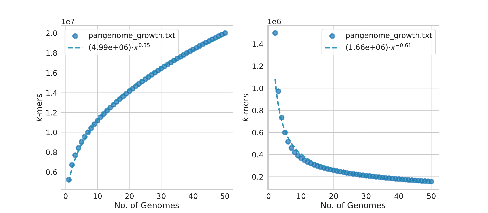
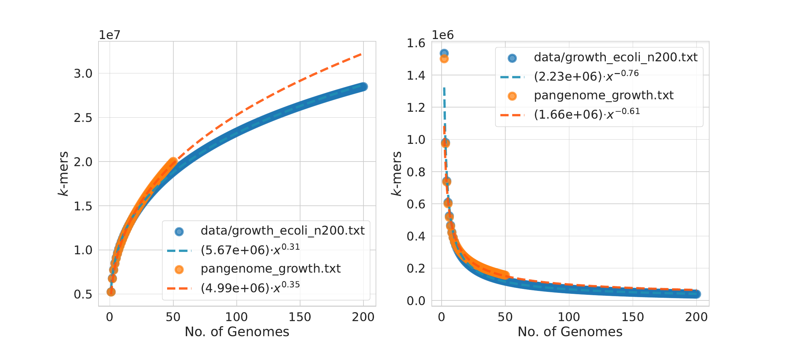
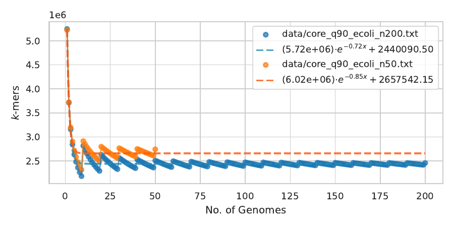

# Pangrowth

`pangrowth` is an efficient tool designed for genomic researchers to predict the [openness of a pangenome](https://doi.org/10.1101/2022.11.15.516472 ) and
estimate the **core** genome size. This tool is capable of analyzing fasta
sequences using **_k_-mers**, as well as other genomic elements such as genes, CDS,
ORFs, provided as either a **frequency histogram** or a **pan-matrix** (with columns
representing genomes and rows representing items; see `panmatrix_ecoli_n50.txt`
for an example).

### Key features

- **_k_-mer counting**: utilizes a modified version of [yak](https://github.com/lh3/yak) to count _k_-mers
- **growth/core calculation**: computes the _exact_ expected genomic growth/core size quadratically in the number of genomes 

### Publications

Parmigiani, L., Wittler, R., Stoye, J.,: [Revisiting pangenome openness with _k_-mers](https://peercommunityjournal.org/articles/10.24072/pcjournal.415/  ). PCI Comp & Biol.  (2024).

## Table of Contents
<!--ts-->
   * [Pangrowth](#pangrowth)
      * [Table of Contents](#table-of-contents)
      * [Install](#install)
         * [Build Pangrowth](#build-pangrowth)
      * [Usage](#usage)
         * [Histogram from fasta files](#histogram-from-fasta-files)
         * [Pangenome growth (from histogram or pan-matrix)](#pangenome-growth-from-histogram-or-pan-matrix)
         * [Pangenome core (from histogram or pan-matrix)](#pangenome-core-from-histogram-or-pan-matrix)
<!--te-->

## Install

```bash
git clone https://gitlab.ub.uni-bielefeld.de/gi/pangrowth.git
cd pangrowth
make 
```

To plot the results we need the following python libraries: numpy, pandas, matplotlib, scipy and searbon. You can install them with:
```
pip install -r dependencies.txt
```

## Usage

### Histogram from fasta files

```bash
./pangrowth hist -k 17 -t 12 data/fa/*.fna.gz > hist.txt
```
- `pangrowth` also accepts a file containing a list of fasta files (each one on a single line) 
    passed with the paremeter `-i fasta_list.txt`

To visualize the histogram:
```bash
python scripts/plot_hist.py hist.txt hist.pdf
```

<p align="center">
    
</p>

If you have multiple histograms that you want to compare with different number
of genomes you can use:

```bash
python scripts/plot_hist.py --norm_x --norm_y=both hist.txt data/hist_ecoli_n50.txt data/hist_ecoli_n200.txt hist_multiple.pdf
```

- The flag `--norm_x` normalize the x-axis to be between (0,1].
- The flag `--norm_y` allows two types of normalization: 
    - `multiplicity` which adjusts each histogram value h[i] multiplying it by its
      index i (i.e., h[i] * i, this means that values appearing once remain the same,
      values appearing twice are doubled, and so on)
    - `percentage` which divides the values of h[i] by the total sum of h (its total
      sum equals 1) 
    The `--norm_y=both` applies both in series.

<p align="center">
    
</p>

### Pangenome growth from histogram (or pan-matrix)

```bash
./pangrowth growth -h data/hist_ecoli_n50.txt > growth.txt
#./pangrowth growth -p data/panmatrix_ecoli_n50.txt > growth.txt
```

To fit the openness and visualize the growth:

```bash
python scripts/plot_growth.py growth.txt growth.pdf
```

<p align="center">
    
</p>

We can again pass multiple growth files to `scripts/plot_growth.py` to
compare with other species.

```bash
python scripts/plot_growth.py growth.txt data/growth_ecoli_n200.txt growth_multiple.pdf
```

<p align="center">
    
</p>

### Pangenome core from histogram (or pan-matrix)

```bash
./pangrowth core -h data/hist_ecoli_n50.txt > core.txt
#./pangrowth core -p data/panmatrix_ecoli_n50.txt > core.txt
./pangrowth core -h data/hist_ecoli_n50.txt -q 0.9 > core_q90.txt
```

- The `-q` takes a quorum to considered the item in the core (default 1.0).

To fit the core genome and report the percentage of core item over the expected
genome size:


```bash
python scripts/plot_core.py core_q90.txt data/core_q90_ecoli_n200.txt core.pdf
```  

The expected genome size is calculated as the total sum of the histogram divided by
the number of genomes.

<p align="center">
    
</p>
