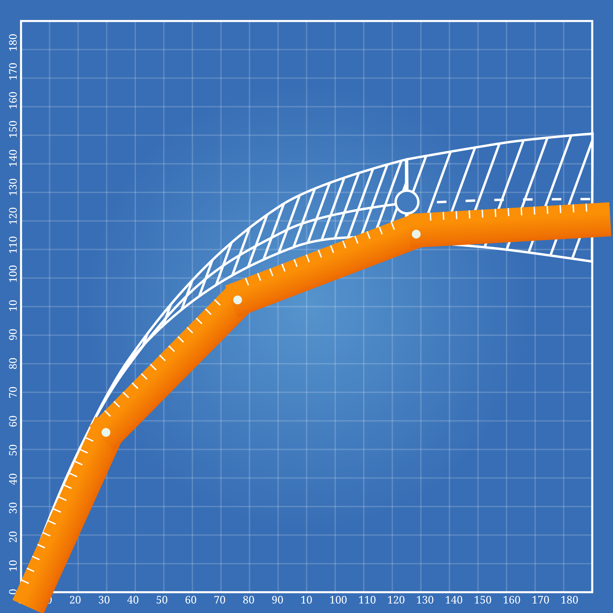
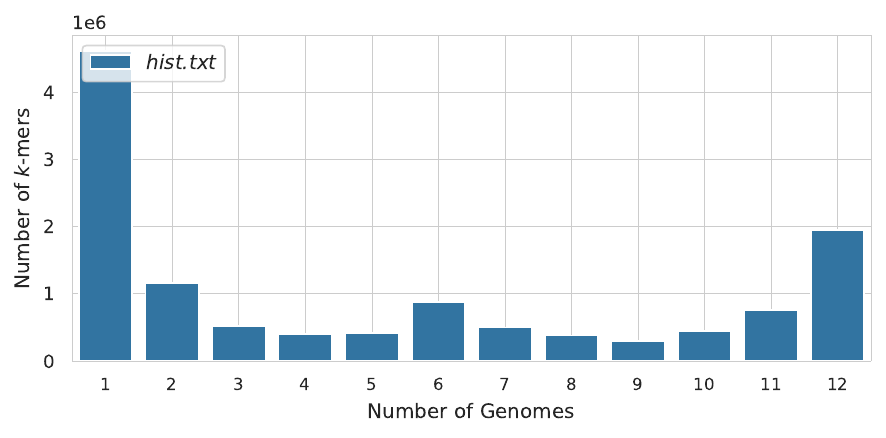
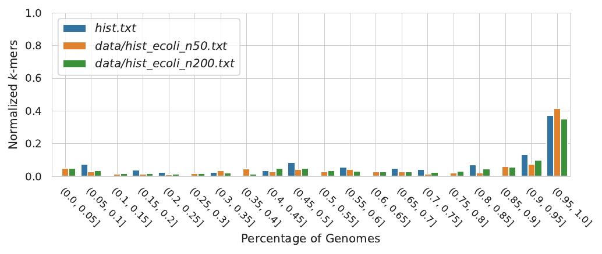
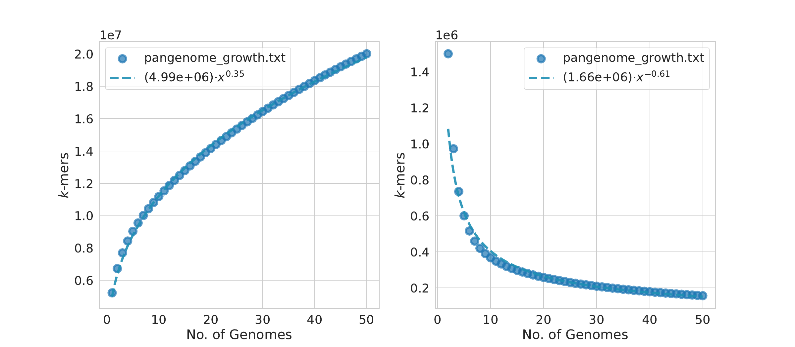
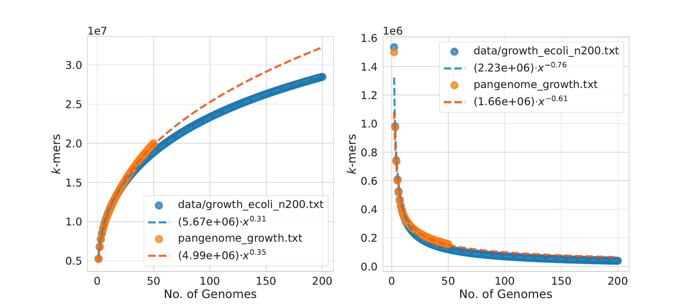
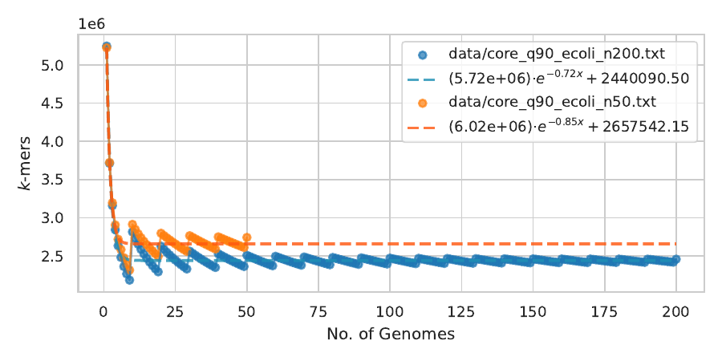

# Pangrowth

<p align="center">
    
</p>

`pangrowth` is an efficient tool designed for genomic researchers to predict the [openness of a pangenome](https://doi.org/10.1101/2022.11.15.516472 ), 
estimate the **core** genome size and the pangenome diversiy using [Hill numbers](https://en.wikipedia.org/wiki/Diversity_index ). 

This tool is capable of analyzing fasta sequences using **_k_-mers**, as well
as any other genomic elements such as genes, CDS, ORFs, as long as it is provided as either a **frequency histogram** or a **pan-matrix** (with columns representing genomes and rows representing items; see `panmatrix_ecoli_n50.txt` for an example).

### Key features

- **_k_-mer counting**: utilizes a modified version of [yak](https://github.com/lh3/yak) to count _k_-mers
- **growth/core calculation**: computes the _exact_ expected genomic growth/core size quadratically in the number of genomes
- **hill numbers**: compute Hill numbers from frequency list
- **colored compacted de Bruijn graph (cdbg)**: estimates pangenome diversity of the ccdbg using Hill numbers, by combining _k_-mer and infix equivalents histograms

## Table of Contents
<!--ts-->
   * [Pangrowth](#pangrowth)
      * [Table of Contents](#table-of-contents)
      * [Install](#install)
      * [Usage](#usage)
         * [Histogram from fasta files](#histogram-from-fasta-files)
         * [Pangenome growth (from histogram or pan-matrix)](#pangenome-growth-from-histogram-or-pan-matrix)
         * [Pangenome core (from histogram or pan-matrix)](#pangenome-core-from-histogram-or-pan-matrix)
         * [Hill numbers from k-mer histogram](#hill-numbers-from-k-mer-histogram)
         * [Colored compacted de Bruijn graph](#colored-compacted-de-bruijn-graph)
      * [Contact](#contact)
<!--te-->

## Install

Default build:

```bash
git clone https://github.com/gi-bielefeld/pangrowth
cd pangrowth
cmake -S . -B build
cmake --build build -j 8
```

This builds the main `pangrowth` executable. The default build does not link
the ggcat C++ API. The executable is `build/pangrowth`; either call it by that
path, add it to `PATH`, or run examples from inside the build directory.

Optional ggcat-enabled build:

```bash
./scripts/build_ggcat_cpp_api.sh

cmake -S . -B build-ggcat -DPANGROWTH_WITH_GGCAT=ON
cmake --build build-ggcat -j 8
```

The helper script downloads ggcat and builds the static C++ API libraries with
`cargo`. The ggcat-enabled executable is `build-ggcat/pangrowth`.

To plot the results we need the following python libraries: numpy, pandas, matplotlib, scipy and searbon. You can install them with:
```
pip install -r requirements.txt
```

## Usage

### Histogram from fasta files

```bash
./pangrowth hist -k 17 -t 12 data/fa/*.fna.gz > hist.txt
```
- `pangrowth` also accepts a file containing a list of fasta files (each one on a single line) 
    passed with the paremeter `-i fasta_list.txt`

To visualize the histogram:
```bash
python scripts/plot_hist.py hist.txt hist.pdf
```

<p align="center">
    
</p>

If you have multiple histograms that you want to compare with different number
of genomes you can use:

```bash
python scripts/plot_hist.py --norm_x --norm_y=both hist.txt data/hist_ecoli_n50.txt data/hist_ecoli_n200.txt hist_multiple.pdf
```

- The flag `--norm_x` normalize the x-axis to be between (0,1].
- The flag `--norm_y` allows two types of normalization: 
    - `multiplicity` which adjusts each histogram value h[i] multiplying it by its
      index i (i.e., h[i] * i, this means that values appearing once remain the same,
      values appearing twice are doubled, and so on)
    - `percentage` which divides the values of h[i] by the total sum of h (its total
      sum equals 1) 
    The `--norm_y=both` applies both in series.

<p align="center">
    
</p>

### Pangenome growth from histogram (or pan-matrix)

```bash
./pangrowth growth -h data/hist_ecoli_n50.txt > growth.txt
#./pangrowth growth -p data/panmatrix_ecoli_n50.txt > growth.txt
```

To fit the openness and visualize the growth:

```bash
python scripts/plot_growth.py growth.txt growth.pdf
```

<p align="center">
    
</p>

We can again pass multiple growth files to `scripts/plot_growth.py` to
compare with other species.

```bash
python scripts/plot_growth.py growth.txt data/growth_ecoli_n200.txt growth_multiple.pdf
```

<p align="center">
    
</p>

### Pangenome core from histogram (or pan-matrix)

```bash
./pangrowth core -h data/hist_ecoli_n50.txt > core.txt
#./pangrowth core -p data/panmatrix_ecoli_n50.txt > core.txt
./pangrowth core -h data/hist_ecoli_n50.txt -q 0.9 > core_q90.txt
```

- The `-q` takes a quorum to considered the item in the core (default 1.0).

To fit the core genome and report the percentage of core item over the expected
genome size:


```bash
python scripts/plot_core.py core_q90.txt data/core_q90_ecoli_n200.txt core.pdf
```  

The expected genome size is calculated as the total sum of the histogram divided by
the number of genomes.

<p align="center">
    
</p>

### Hill numbers from k-mer histogram

Hill numbers measure pangenome diversity (species richness, exponential entropy, inverse Simpson index) from a _k_-mer frequency histogram:

```bash
./pangrowth hill -p 30 data/hist_ecoli_n50.txt
```

- `-p INT` sets the number of sample points (default: 30); use `-p 0` to output all points
- `-f FILE` reads sample points from a file (one integer per line), overriding `-p`

The output is a tab-separated table with columns: `fit`, `m`, `richness`, `exp_entropy`, `inv_gini_simp`, where `fit` is `int` (interpolation), `obs` (observed), or `ext` (extrapolation) and `m` is the number of genomes.

### Colored compacted de Bruijn graph

The colored compacted de Bruijn graph (cdbg) compacts non-branching path of _k_-mers into **unitigs**. Its diversity can be estimated by combining a _k_-mer histogram with an **infix equivalents histogram**.

**Step 1**: generate the infix equivalents histogram.

From fasta files:

```bash
./pangrowth hist -k 17 -t 12 data/fa/*.fna.gz > hist.txt
./pangrowth hist_infix -k 17 -t 12 -T data/fa/*.fna.gz > hist_infix.txt
```

Options for `hist_infix` are the same as for `hist`:
- `-k INT` _k_-mer size (default: 17)
- `-t INT` number of worker threads (default: 4)
- `-i PATH` file containing a list of fasta files (one per line)
- `-b` turn off canonical _k_-mer transformation
- `-T` account for telomeres breaking unitigs
- `-c INT` minimum _k_-mer count to consider a (_k_+1)-mer (default: 1)

From a colored ggcat _k_-mer graph:

```bash
ggcat build -c -k 17 -d inputs.tsv -o graph_k17.fa -t ggcat_tmp -j 8 --min-multiplicity 1
./pangrowth hist_infix_ggcat -k 17 -t 1 graph_k17.fa > hist_infix.txt
```

The `inputs.tsv` file must contain one color name and one fasta path per line,
separated by a tab. The ggcat build used here currently requires `-j` to be a
power of two (eg, `1`, `2`, `4`, `8`...).

`hist_infix_ggcat` computes the graph-induced infix equivalents histogram from
one colored compacted de Bruijn graph. For an edge candidate $axb$, its color
set is computed as $C(ax) \cap C(xb)$ from the adjacent _k_-mer color sets.

**Step 2**: compute Hill numbers for the cdbg using both histograms:

```bash
./pangrowth hill_cdbg hist.txt hist_infix.txt
```

The output format is identical to `hill`: a tab-separated table with columns `fit`, `m`, `richness`, `exp_entropy`, `inv_gini_simp`.

## Publication

Parmigiani, L., Wittler, R., Stoye, J.,: [Revisiting pangenome openness with _k_-mers](https://peercommunityjournal.org/articles/10.24072/pcjournal.415/  ). PCI Comp & Biol.  (2024).

## Contact

For any question, feedback or problem, please feel free to file an [issue](https://github.com/gi-bielefeld/pangrowth/issues/new) on Github or contact me [here](mailto:pangenomics-service@cebitec.uni-bielefeld.de) and I will get back to you as soon as possible.

Pangrowth is provided as a service of the [German Network for Bioinformatics Infrastructure (de.NBI)](https://www.denbi.de/). We would appriciate if you would participate in the evaluation of Pangrwoth by completing this [very short survey](https://www.surveymonkey.de/r/denbi-service?sc=bigi&tool=pangrowth).
